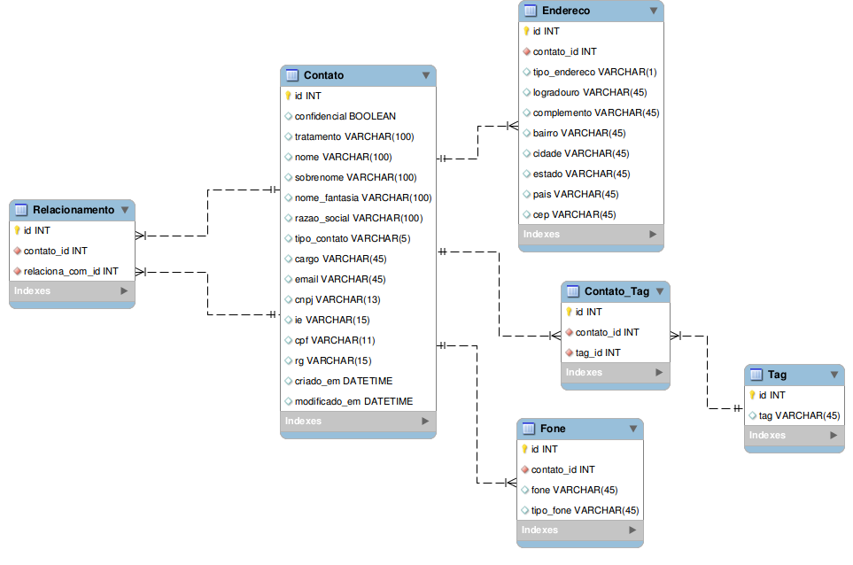

Agenda
======

# Objetivo

Modelar uma agenda de contatos onde um contato possa se relacionar com outras pessoas, semelhante aos relacionamentos do Facebook e Google+.

Além disso o contato pode possuir vários endereços, telefones e tags. As tags servem para melhorar a identificação de cada contato.

# Itens

**mer.tex** é a modelagem conceitual (coloquei apenas as entidades). Para fazer este documento eu usei o [LaTeX][0] junto com o pacote [tikz-er2][2].

Para compilar o documento use o comando

	$ latexmk -pdf mer.tex && latexmk -c

Para converter o **pdf** em **jpg** use o [Imagemagick][3].

	$ convert -density 300 mer.pdf mer.jpg

**modelagem.png** mostra as tabelas feitas no *Workbench*.

**agenda_django.png** são as tabelas feitas no *Django*.

**agenda_mysql_workbench.sql** é o schema exportado do *Workbench*.

**agenda.sql** é o schema exportado do sqlite3.

**models.py** é a *receita* de como fazer o modelo no *Django*.

**admin.py** mostra em especial o uso do *TabularInline*.

**Todo**: Leia [Como criar um site com formulário e lista em 30 minutos][1] e tente você mesmo recriar o modelo no Django.

[0]: http://latexbr.blogspot.com.br/
[1]: http://pythonclub.com.br/criar-site-com-form-lista-30-min.html
[2]: https://bitbucket.org/pavel_calado/tikz-er2/wiki/Home
[3]: http://grandeportal.blogspot.com.br/2012/06/editando-imagens-no-imagemagick.html